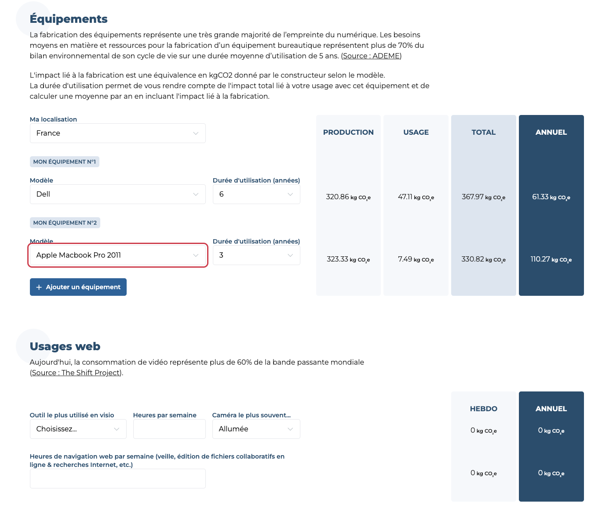

# MyImpact — Digital Environmental Footprint Calculator

MyImpact is a free, open-source, browser-based calculator that helps individuals estimate the annual climate impact of their professional digital equipment, online activities, cloud storage, email and business travel.

The calculator reports results in kilograms of carbon-dioxide equivalent (`kgCO₂e`). All calculations run locally in the browser: answers entered in the calculator are not sent to a backend.

Live website: [myimpact.isit-europe.org](https://myimpact.isit-europe.org)



## Version 1.3.0

Version 1.3.0 improves privacy, accessibility and input reliability, and extends the equipment catalogue with:

- Internet box / Wi-Fi router;
- USB flash drive;
- external SSD;
- external hard drive;
- external webcam, manufacturing impact only.

The webcam hardware footprint is deliberately separated from video-conferencing usage. Network transfer and service usage remain calculated in the video-conferencing section, preventing the hardware and usage scopes from being confused.

## Available languages

| Language | Path |
|---|---|
| English | `/` |
| French | `/fr/` |
| Dutch | `/nl/` |
| German | `/de/` |
| Spanish | `/es/` |
| Italian | `/it/` |

## What MyImpact calculates

The calculator covers six areas:

1. **Equipment** — manufacturing and electricity use of computers, phones, tablets, displays, printers, network equipment, external storage and webcam hardware.
2. **Online activity** — video conferencing and web browsing.
3. **Cloud storage** — annual footprint estimated per stored gigabyte.
4. **Email** — messages sent with and without attachments.
5. **Business travel** — plane, train and car travel.
6. **Results** — annual totals, comparisons and illustrative equivalents.

The result is an estimate, not a product-level life-cycle assessment. Hardware declarations, electricity mixes, lifetimes and usage patterns all carry uncertainty.

## Equipment model

For each device, MyImpact stores:

- `production`: embodied climate impact in `kgCO₂e`;
- `usage`: estimated annual electricity consumption in `kWh`;
- the user-selected lifetime;
- the electricity mix of the selected country.

The annual impact is calculated as:

```text
(production + annual electricity × electricity factor × lifetime) / lifetime
```

New version 1.3 equipment factors are maintained in [`equipment-additions.js`](equipment-additions.js). They use generic archetypes rather than claiming precise comparisons between manufacturers.

### Version 1.3 equipment factors

| Equipment | Embodied impact | Annual electricity | Main source |
|---|---:|---:|---|
| Internet box / Wi-Fi router | 36.1 kgCO₂e | 87.6 kWh | BoaviztAPI / ADEME Base Empreinte |
| USB flash drive | 6.25 kgCO₂e | 0.1314 kWh | BoaviztAPI / ADEME Base Empreinte |
| External SSD | 109 kgCO₂e | 1.095 kWh | BoaviztAPI / ADEME Base Empreinte |
| External hard drive | 15.8 kgCO₂e | 3.3945 kWh | BoaviztAPI / ADEME Base Empreinte |
| External webcam | 3.17 kgCO₂e | Not included | Logitech C920e PCF, manufacturing phase |

The webcam value represents 56% of the verified 5.66 kgCO₂e product footprint published for the Logitech C920e. Its electricity and video traffic are excluded from this equipment entry. Video-conferencing usage is calculated separately.

The equipment selector also provides two current generic choices: **recent laptop, including MacBook** and **recent smartphone, including iPhone**. Their embodied values come from the detailed Impact CO₂/ADEME categories (`ordinateurportable` and `smartphone`) and are refreshed through the API. Impact CO₂ expresses use as `kgCO₂e/year`; MyImpact converts that value to annual electricity using its French electricity factor (`0.052 kgCO₂e/kWh`) before applying the location selected by the user. The Apple names are examples that help users choose a family; the factors are generic market estimates and must not be interpreted as Apple model-specific declarations. Historical MacBook entries remain available for users who own those devices.

### Additional electricity mixes

Version 1.3 adds six locations using Ember’s 2025 lifecycle carbon intensity of electricity generation, processed by Our World in Data.

| Location | Electricity factor |
|---|---:|
| Morocco | 0.5964 kgCO₂e/kWh |
| Tunisia | 0.56029 kgCO₂e/kWh |
| United Kingdom | 0.21741 kgCO₂e/kWh |
| Poland | 0.5886 kgCO₂e/kWh |
| Romania | 0.25075 kgCO₂e/kWh |
| Portugal | 0.12791 kgCO₂e/kWh |

## Other calculation factors

| Activity | Factor |
|---|---:|
| Email without attachment | 4 gCO₂e/message |
| Email with attachment | 35 gCO₂e/message |
| Cloud storage | 209.5 gCO₂e/GB/year |
| Web browsing | 10 gCO₂e/hour |
| Thermal car | 0.142253 kgCO₂e/km |
| Train | 0.00173 kgCO₂e/km |
| Medium-haul flight | 0.184661 kgCO₂e/km |

Video-conferencing factors vary by platform. Enabling the camera increases the usage estimate by a factor of 2.6; this concerns service usage and does not represent webcam manufacturing.

## Impact CO₂ API and carbon equivalents

MyImpact retrieves the current comparison and travel factors from the public [Impact CO₂ API](https://impactco2.fr/doc/api), published by ADEME:

- `/api/v1/thematiques/ecv/alimentation` for a meal with beef;
- `/api/v1/thematiques/ecv/numerique` for laptops and smartphones;
- `/api/v1/thematiques/ecv/transport` for thermal cars and medium- and long-haul flights.

The total in `kgCO₂e` is divided by the corresponding API factor to produce each illustrative equivalent. The Paris–New York return-trip comparison uses the long-haul flight factor; the generic flight-distance comparison and business-travel calculation use the medium-haul factor.

MyImpact is a static website and does not expose an API key. Anonymous API requests are supported at the time of this release but may be restricted by Impact CO₂ in the future. [`impactco2-equivalents.js`](impactco2-equivalents.js) therefore embeds the following current fallback values so the calculator remains available if the API cannot be reached:

| Equivalent or activity | Fallback factor |
|---|---:|
| Meal with beef | 4.97 kgCO₂e/meal |
| Thermal car | 0.1422534122 kgCO₂e/km |
| Medium-haul flight | 0.184661 kgCO₂e/km |
| Long-haul flight | 0.177894 kgCO₂e/km |
| Laptop | 192.62004125 kgCO₂e/device |
| Smartphone | 80.155343125 kgCO₂e/device |

Users can inspect the [Impact CO₂ carbon comparator](https://impactco2.fr/outils/comparateur#simulateur) and the [downloadable equivalent list](https://impactco2.fr/equivalents.csv). These comparisons are illustrative orders of magnitude, not avoided-emission claims.

## Sources and methodological references

- [ADEME — Digital purchasing footprint calculator](https://agirpourlatransition.ademe.fr/particuliers/evaluer-son-impact/calculer-impact-achats/calculez-empreinte-carbone-achats-numeriques)
- [ADEME — La face cachée du numérique](https://librairie.ademe.fr/consommer-autrement/5226-guide-pratique-la-face-cachee-du-numerique.html)
- [ADEME Base Empreinte](https://base-empreinte.ademe.fr/)
- [BoaviztAPI routes and equipment archetypes](https://doc.api.boavizta.org/Reference/routes/)
- [Boavizta environmental footprint methodology](https://doc.api.boavizta.org/Explanations/embedded_methodology/)
- [EcoDiag by EcoInfo/CNRS](https://ecoinfo.cnrs.fr/ecodiag-calcul/)
- [EcoDiag source code](https://gitlab.in2p3.fr/ecoinfo/ecodiag)
- [EcoInfo overview of digital environmental impacts](https://ecoinfo.cnrs.fr/2019/04/30/introduction-aux-impacts-environnementaux-du-numerique/)
- [Logitech C920e verified product carbon footprint](https://www.logitech.com/content/dam/logitech/en/sustainability/carbon-labeling-messaging/carbon-clarity/pdf/carbon-footprint-webcam-c920e.pdf)
- [Green Cloud Computing — Umweltbundesamt](https://www.umweltbundesamt.de/sites/default/files/medien/5750/publikationen/2021-06-17_texte_94-2021_green-cloud-computing.pdf)
- [Greenspector video-conferencing study](https://greenspector.com/fr/quelle-application-mobile-de-visioconference-pour-reduire-votre-impact-edition-2021/)
- [ENERGY STAR](https://www.energystar.gov/)
- [Nos Gestes Climat — Internet](https://nosgestesclimat.fr/documentation/num%C3%A9rique/internet)
- [Ember/Our World in Data — lifecycle carbon intensity of electricity](https://ourworldindata.org/grapher/carbon-intensity-electricity)
- [Impact CO₂ carbon comparator](https://impactco2.fr/outils/comparateur#simulateur)
- [Impact CO₂ API documentation](https://impactco2.fr/doc/api)

EcoDiag is included as a methodological reference for equipment inventory, stock/flow approaches and lifetime allocation. Boavizta and EcoDiag share part of their manufacturer-data collection work; these sources should therefore not be treated as independent measurements when assessing uncertainty.

## Privacy

- Calculator answers remain in the browser.
- The browser contacts `impactco2.fr` to refresh six public carbon factors. These requests expose ordinary connection metadata such as the IP address and user agent to Impact CO₂/ADEME, but contain none of the answers entered in MyImpact. See the [Impact CO₂ privacy policy](https://impactco2.fr/politique-de-confidentialite) and [legal notice](https://impactco2.fr/mentions-legales).
- Matomo is hosted by INR at `analytic.institutnr.org`.
- Analytics are loaded only after explicit consent through tarteaucitron.js.
- Privacy and cookie-management links are localized for every supported language.
- DPO contact: [dpo@institutnr.org](mailto:dpo@institutnr.org).

## Accessibility and validation

Version 1.3 restores browser zoom, visible keyboard focus and accessible disclosure state. Dynamically added equipment fields receive unique identifiers. Negative and invalid numeric inputs are normalized to zero.

## Technical stack

- static HTML5, CSS and JavaScript;
- jQuery 3.7.1;
- tarteaucitron.js for consent management;
- self-hosted Matomo analytics;
- the public Impact CO₂ API, with local fallback factors;
- self-hosted Montserrat variable font;
- no application backend and no build step.

## Run locally

```bash
python3 -m http.server 8080
```

Then open [http://localhost:8080](http://localhost:8080).

## Verification

Ruby and Node.js are required for the static checks:

```bash
ruby tests/check-static.rb
```

The checks cover local links, the accessible viewport, consent configuration, direct Matomo loading, input validation, dynamic identifiers and JavaScript syntax for all six calculators.

## Project structure

```text
myimpact/
├── index.html
├── scripts-en.js
├── equipment-additions.js
├── cookie-consent.js
├── stylesheet-inr.css
├── fr/ nl/ de/ es/ it/
├── tests/check-static.rb
├── tarteaucitron/
├── sitemap.xml
└── robots.txt
```

## Contributors and history

| Version | Date | Main changes |
|---|---|---|
| 1.0 | 2020 | Initial architecture by Julien Gontier (Decathlon) |
| 1.1 | July 2022 | Updated indicators and new sections by athom |
| 1.2 | 2026 | Updated sources, German/Spanish/Italian translations, privacy and SEO work by Guillaume Gallon / INR France |
| 1.3 | 2026 | Consent, accessibility, validation, tests and additional equipment families |

MyImpact is maintained by:

- [Institut du Numérique Responsable — INR France](https://institutnr.org)
- [ISIT Belgium](https://isit-be.org)
- [ISIT Switzerland](https://isit-ch.org/)

## Acknowledgements

We warmly thank everyone who has helped create, maintain and improve MyImpact:

- **Julien Gontier (Decathlon)** for the original calculator architecture released to INR in 2020;
- **athom** for the 2022 indicator update and additional sections;
- **Guillaume Gallon and INR France** for the 2026 maintenance, translations, privacy, accessibility, validation and equipment updates;
- the **INR France, ISIT Belgium and ISIT Switzerland** communities for maintaining and reviewing the project;
- **EcoInfo/CNRS and the EcoDiag contributors** for their open methodology and work on IT equipment inventories;
- the **Boavizta contributors** for their open data, documented archetypes and environmental-impact methodology;
- the **Impact CO₂ team and ADEME** for maintaining a free API, an open comparator and regularly updated carbon-equivalent data;
- **Umweltbundesamt**, **Greenspector**, **ENERGY STAR** and the manufacturers publishing reviewed product environmental reports for making the underlying studies available.

The complete commit history remains the authoritative record of individual code contributions. Thank you to every contributor who reports an issue, improves a translation, reviews a factor or submits a signed contribution.

Contributions must follow [`CONTRIBUTING.md`](CONTRIBUTING.md), including the Developer Certificate of Origin sign-off.

## License and third-party material

The repository is currently released under [CC0 1.0 Universal](LICENSE), as stated in the authoritative license file. Third-party libraries, fonts, icons, logos, trademarks and source data are excluded from that dedication and remain subject to their respective terms. See [Third-party notices](THIRD_PARTY_NOTICES.md).
